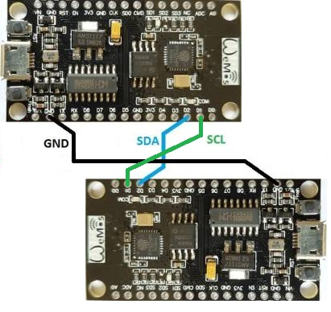

# I2C-tool
This github project contains two Arduino sketches aiming at testing I2C communication.

## Introduction
The first sketch [I2C-tool](I2C-tool) is the key one. 
It is an ESP8266 firmware implementing an I2C slave with spy, loop-back and configurable clock stretch injector.

The second sketch [I2Ctest8266](I2Ctest8266) is a test sketch.
It tests the I2C master implementation (a bit bang driver) of ESP8266.
It uses the I2C-tool for loopback.

## Test setup
The two sketches each run on an ESP8266 using the following setup.

Sketch `I2Ctest8266.ino` runs on ESP8266 number 1, mastering I2C transactions to ESP8266 number 2.
ESP8266 number 2 runs the `I2C-tool.ino` looping back messages send by ESP8266 number 1.

The goal is to test the ESP8266 I2C driver (`core_esp8266_si2c.c`) which comes with Arduino setup for ESP8266.
Since the ESP8266 does not have a working I2C hardware peripheral, 
the I2C driver is completely written in software (a so-called "bit bang" driver).

## Wiring
The actual wiring is simple: connect the two ground pins GND (black),
connect the two clock pins (SCL) D1 (green), and connect the two data (SDA) pins D2 (blue).

Wire both ESP8266's with USB to a PC. Load one with I2C-tool, flash it, run it, 
and monitor the serial output, it shows the loop-back traffic. Load the other with the I2Ctest8266, 
flash it, run it, and monitor the serial output, it shows the test results. 

## Details
The "user manual" of the I2C-tool is the [readme](I2C-tool) associated with that sketch.

The [readme](I2Ctest8266) of the I2Ctest8266 explains what is tested and the problems found in the
bit bang driver.
